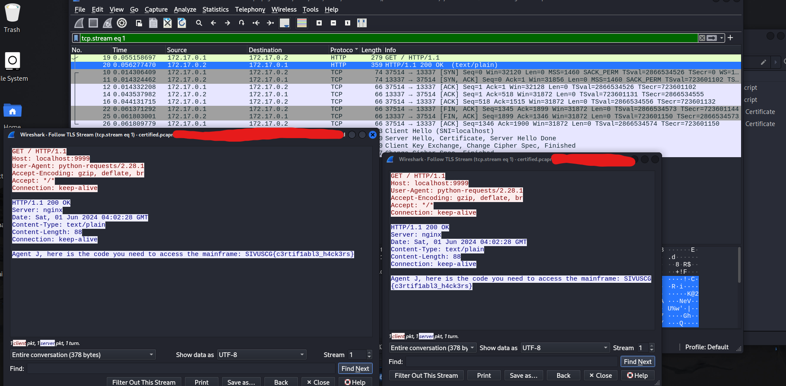

# Cyber Games Main

Flag type:
`SIVUSCG{xxxxx}`

## Certified

### Task 
```
Certified
100
One of our machines was recently hit with malware and appears to have opened a backdoor. We were able to get this PCAP from around the time when it was accessed but aren't sure what was exfiltrated from the network. Take a look and see if you can make sense of it!

Author: tsuto

https://ctfd.uscybergames.com/files/6f9d8cad46a69ec3408cc68560d9cf64/certified.pcapng?token=eyJ1c2VyX2lkIjoxOTYyLCJ0ZWFtX2lkIjpudWxsLCJmaWxlX2lkIjoyODR9.Zl8ZzQ.CeNN3KtBazLgH3kKEPxxpYsItzM

```

### My Solve

- Given a pcap file we can see there are exports available. We export the backdoor.php files
- take a look into them and see the cert and the RSA keys. 
  - separate the key to into a cert and key.pem (RSA) file 
  - then in wireshark, edit preferences, add the TLS RSA key in. 
  - then follow the TLS stream again and you'll see the message. 

`SIVUSCG{c3rtif1abl3_h4ck3rs}`




## Touch Grass

### Task 

### My solve


## Prime Time 

### Task 
```
Prime Time [Crypto]
150

```

### My Solve

- we download the file and open it. I think you know what to do... 

```
Your encrypted flag: 67901295092999403377812474031753022640207373798290839976120254385637043193411358791915464230611073615341268787302565972547452757697916207952702288626173819641234095639259743277146365018265212857092237457393449677065307951821155969047439248276581778411840300731922481525641974287306159852931109413442675622573
Public Key:
n: 98813858186636016061828413291587334532178109240417756890955763078740391019450718373743031325554048662069578591495075978203742992839688516726192682096525494907367614705518833413598767554267177141399324414271413882430512533175133684772034149758259287505147508079731874384109521277000217376431320424120947279649
e: 65537
```